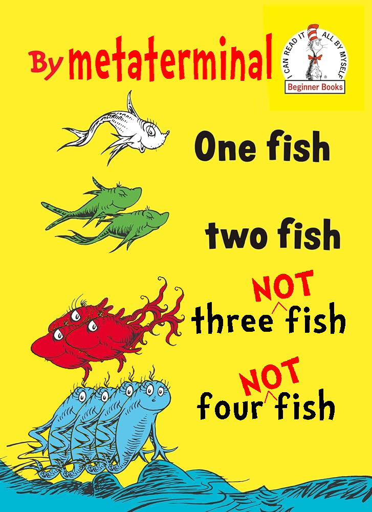

+++
title = "A very short rant about the meaning of the term 'fish puzzle'"
date = 2026-07-07

[taxonomies]
tags = ["puzzles","history"]
+++

A brief history lesson for you.<!-- more -->

Puzzup is an organizational software used for writing puzzlehunts. (Additional rants about Puzzup may be available at a later date.) One of the features it has is that lets you rate puzzle difficulty after testsolving, using a 1-6 point scale. Language here is mine for brevity:

1. Too Easy. Readily solved by existing tools. (nb: This line gets a little blurry when considering LLMs; this guideline refers more to things like cryptogram or sudoku solvers.)
2. Easy. Straightforward puzzle with at most one aha. Most teams will solve this.
3. Medium. Most teams will solve this in under 5 person-hours; competitive teams will solve it faster. (5 person-hours means five people working for an hour.)
4. Hard. Competitive teams will solve this in under 5 person-hours; non-competitive teams may take longer.
5. Mystery Hunt Hard. What people think of when they think "Mystery Hunt puzzle"; requires specialist knowledge, difficult insights, and a particularly long solve time. 
6. Too Hard. Too long or difficult to be included in Hunt (e.g. [Ripple Effect](https://epilogue.mitmh2024.com/puzzle/ripple-effect)).

I don't know how long these ratings have been around. Puzzup is an evolution of an old, old, old piece of software; it started being called by its current name in [2021](https://github.com/Palindrome-Puzzles/puzzup) (by Palindrome), where it was cloned from [Puzzlord](https://github.com/galacticpuzzlehunt/puzzlord) (a 2019 incarnation by Galactic), which itself was ultimately descended from [Puzzletron](https://github.com/mysteryhunt/puzzle-editing/) (instantiated by Codex). The Puzzletron git repo has an initial commit "Initial import from Metaphysical Plant's hunt software" on Feb 2, 2011 (presumably in preparation for the 2012 hunt). That and other early commits lead me to believe that the first incarnation of this software was developed by Plant in 2010 for the 2011 hunt. And in the last 16 years, someone came up with this 1-6 difficulty rating. 

(Incidentally, we can also see what a bit of the old 2011 Puzzletron formatting looked like in the puzzle [Piercing the Veil](https://puzzles.mit.edu/2012/puzzles/watson_2_0/piercing_the_veil/).)

***

In 2015, Team Random ran their incarnation of MIT Mystery Hunt, themed around 20,000 Leagues Under the Sea. Solvers dove to the bottom of the seafloor, with rounds themed around shoals of a Pod of Dolphins, a Treasure Chest, and so forth. One round was called the School of Fish round, and it was notable for two very specific reasons:

1. It had 56 puzzles in it. (The second-largest round in the hunt had 9.)
2. All 56 puzzles were extremely, extremely easy. In my opinion they would all get 1s (or at most 2s) on the Puzzup difficulty scale.

(Hence the name "school of fish" for the round: it's a large swarm of small things. Cute!)

This led immediately to the term "fish puzzle" to describe these extremely easy puzzles, and a "fish round" to describe a round with many extremely easy fish puzzles. This was a popular term, not least because School of Fish was very evocative. Reading through the [reddit AMA](https://www.reddit.com/r/mysteryhunt/comments/2tjp0v/were_the_random_fish_we_wrote_the_mystery_hunt/) about the hunt immediately after, many solvers commented positively on the round, and it is iconic enough to have broad recognition even today (I don't think I could say the same for many other rounds in the same hunt). 

***

But somewhere along the line, the fish began to mutate, in the dark...

I don't know how to track these changes over time, but I know where the story ends: in the wrapup for the 2026 Mystery Hunt, Cardinality referred to the Kingdom puzzles (puzzles from the first half of the hunt) as fish puzzles. These are puzzles with difficulty ratings from 2 to 4. This definition was more or less immediately corrected by Benji, but it is emblematic of a wider definition drift I have observed: many people on a number of teams have begun to refer to these puzzles as fish.

This definition drift is utterly insane to me. Eleven years ago, a fish puzzle would be considered on the tougher side if it had an Easy (2) rating... and now it is common parlance to refer to Hard (4) puzzles as fish! This is not just Cardinality, either; I think this understanding of "fish" as "somewhat easier puzzle towards the start of the hunt" is far, far, far more common among solvers who only started hunting this decade. At some point, the original meaning was lost.

I am a linguistic descriptivist, but also I hate this. Change it back! You don't need a special name to describe more approachable puzzles in the first half of the hunt! That's just what most puzzles in the hunt are! Team Random did not invent the idea of easy puzzles in 2015! The whole thing that was *interesting* about that round -- the whole reason that fish puzzles got a special term in the first place -- was because all those puzzles were much, much easier than anyone thought would be possible in a Mystery Hunt! Cardinality already had a bunch of 1-2 difficulty we could refer to as "fish" -- they were all in Terminus!

Is this why the hunt is ballooning in scope? ([Probably not](/blog/hunt-analysis).) Gah! Don't say "fish puzzle" unless you mean it!

Say it with me: fish means 1 or 2, not 2 through 4!

 

***

***

***

EDIT JULY 7: Thanks to everyone who sent me comments. Apparently Cardinality did not internally refer to Kingdom puzzles as fish puzzles, and it was just a term that snuck its way into the wrapup slide deck, which is interesting. But other writers and solvers did corroborate that they have observed (or participated in) the linguistic drift, so I'm not alone!

Also, ManyPinkHats made this:

My sides hurt. Good stuff.

***

***

***

EDIT JULY 8: According to Anderson from ✈✈✈ Galactic Trendsetters ✈✈✈:

> IIRC, Puzzletron originally had fun and difficulty ratings from 1-7. When we made puzzlord we kept that for one year (2018?) and then changed to 1-6 the next year for a variety of reasons (e.g. it didn't feel like we needed that much gradation, also testers were giving everything 4 fun ratings and we wanted an even number so you couldn't pick the average by default).

This inspired me to go digging through the old git logs even more thoroughly, and I found a few things:

The initial commit of Puzzletron had [no difficulty ratings at all](https://github.com/mysteryhunt/puzzle-editing/commit/f67a67d63aa78708c4ca94132f1dce9dbbc116ac#diff-0524b271e915e8060f768ae50abd7ea860fa5ec3b9d842218c2c207347d77f1d) (see test.php), just a free-answer box. It didn't even ask how hard the puzzle was until [July 23, 2011](https://github.com/mysteryhunt/puzzle-editing/commit/e34810123005a5606eaf169229cb5e6e2403b559) (though it was still a free-answer field).

It was Alice Shrugged, when writing for MH14, that [introduced the first numeric difficulty ratings](https://github.com/mysteryhunt/puzzle-editing/commit/701d8568f1cf01ad87249ba66fcf4d9b01ba4eb0): 1-5, with no rubric! Indeed, it took until Setec (writing for MH17) to even clarify that [1 was easy, and 5 was hard](https://github.com/mysteryhunt/puzzle-editing/commit/b2ce8d3fe54a87a52f0cbabef873b0ae78445ae0)... 

Interestingly, Setec used the same benchmarks that Random did for their fish puzzles -- that is, difficulty ratings of 1 or 2 -- to measure their "character" puzzles (the puzzles in the first 6 rounds of the hunt). They used [different, hunt-specific internal terminology](https://github.com/mysteryhunt/puzzle-editing/commit/70a25c30e9137d3027b8f103978813ed26fa8bed) for this. MH17 was before my time, so I'm curious whether people think these difficulty benchmarks measured up. (But also, with a 1- 5 rating, o a "difficulty rating of 1 or 2" may have had an entirely different meaning than I outlined in the main article.) 

This 5-point scale apparently continued through to the writing of MH18, where the Puzzletron trail grows cold. Then there doesn't seem to be any public data for the software used when writing MH19 or MH20, but by Puzzlord's initial commit when writing for MH21, we see the 1-6 difficulty ranking we all know and love today, with the following descriptions:

1. very easy
2. easy
3. somewhat difficult
4. difficult
5. very difficult
6. extremely difficult

I'm not super certain when the descriptions of difficulty got written, but it might have been by Death and Mayhem when writing MH25? (They wrote a lot of documents.)

So there: somewhere between January 2018 and January 2020 the point scale went from 1-5 to 1-6, with the possibility that it was 1-7 at some point in the interim. 
