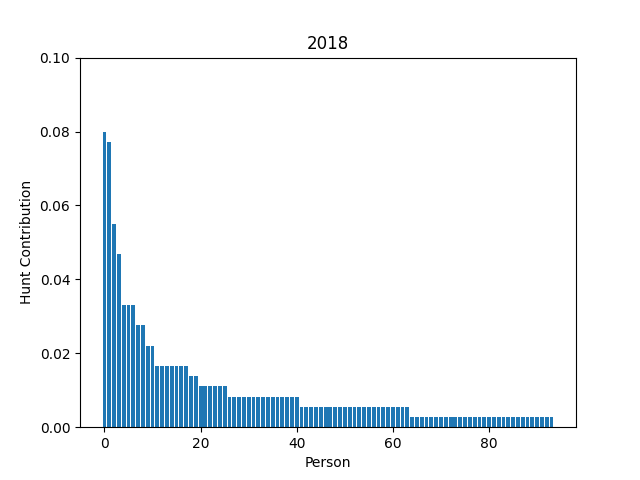
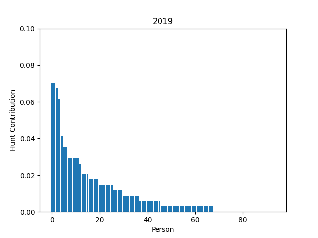
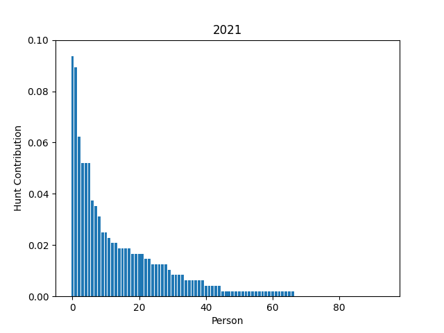
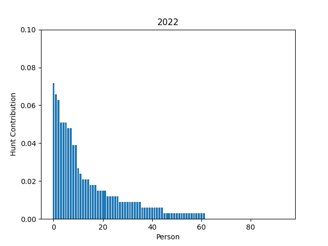
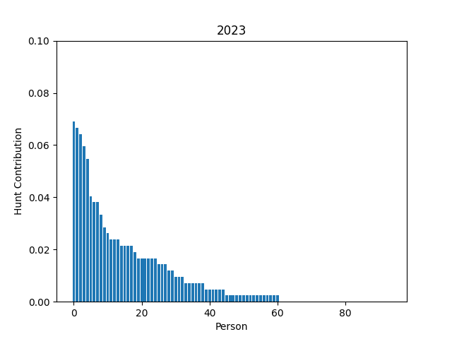
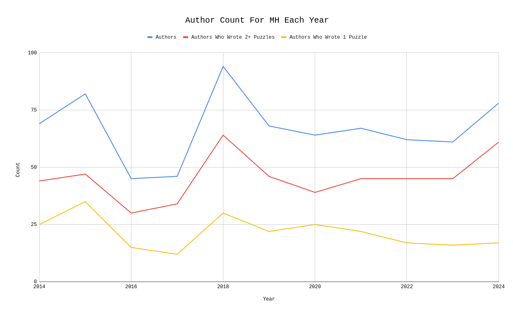
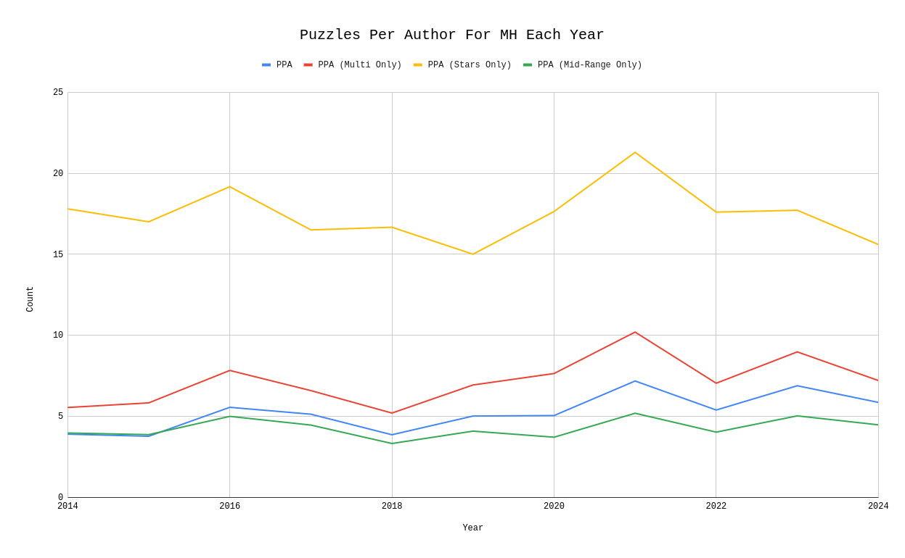
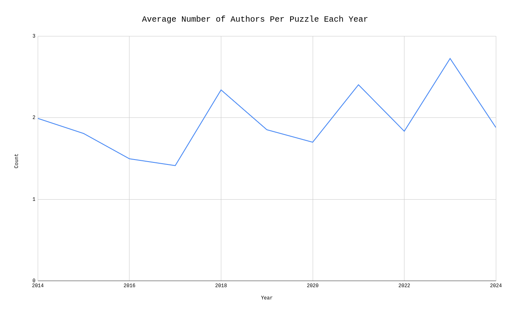
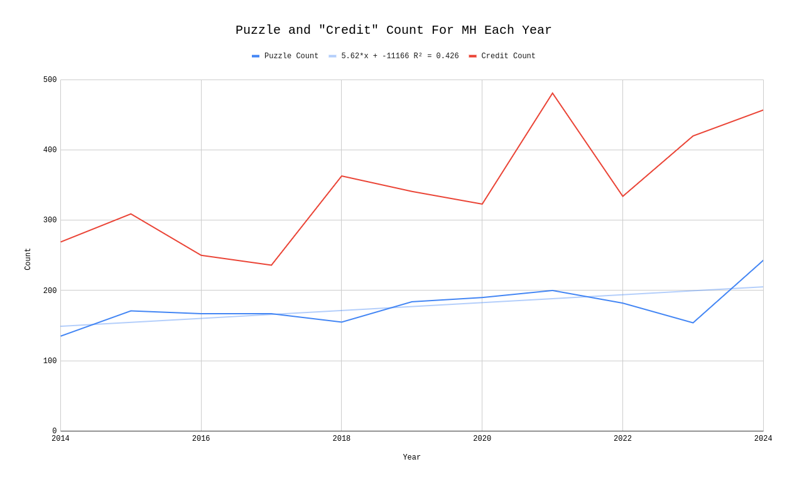
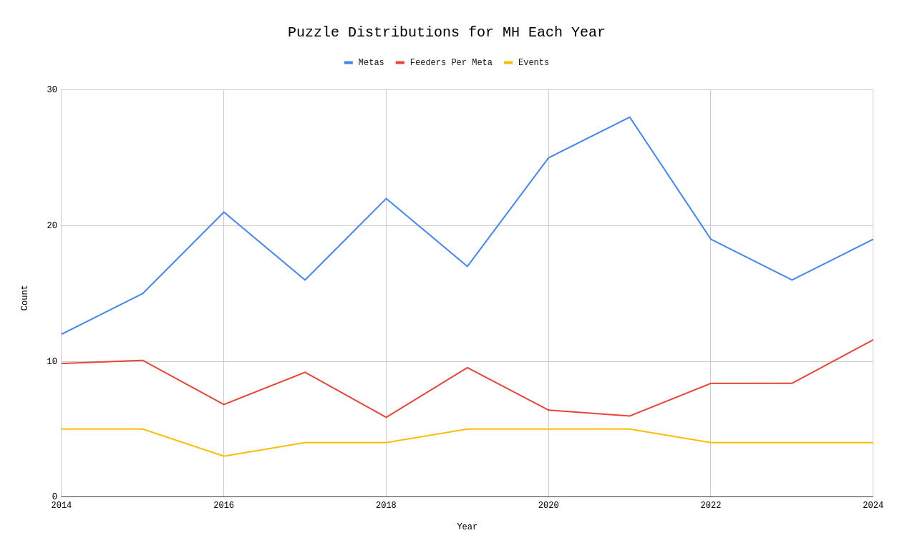

+++
title = "Mystery Hunt writing teams, by the numbers"
date = 2025-06-16

[taxonomies]
tags = ["analysis","puzzles","math"]
+++

I've recently been thinking about the composition of writing teams for Mystery Hunt.

<!-- more --> 

If you have been even vaguely paying attention to the puzzlehunt community in the last 5 years, you probably have heard: Mystery Hunt is *really really big*. Writing something that large, with so many people involved, has to somehow (*eventually*) transform into an industrial process. 

So how large, exactly, are these writing teams? Is there a lot of variance in the number of writers? What does the breakdown of manpower look like?

Is it true that if you're capable of winning a modern Mystery Hunt, you're capable of writing one?

And, additionally: if your puzzlehunt team won today, how big of a Mystery Hunt could you write?

### Table of Contents

1) <a href="#disclaimer">Disclaimers</a>
2) <a href="#related">Related Works</a>
3) <a href="#methodology">Methodology</a>
4) <a href="#writing-teams">What do writing teams look like?</a>
    1) <a href="#types">Author Types</a>
    2) <a href="#coauthors">Co-Authorship</a>
5) <a href="#bigger">Is Mystery Hunt getting bigger?</a>
    1) <a href="#count">Puzzle Count</a>
    2) <a href="#length">Time</a>
    3) <a href="#team-size">Team Size</a>
    4) <a href="#speculation">Things That Aren't Numbers</a>
6) <a href="#my-team">How big could my writing team's Mystery Hunt be?</a>

<h3 id="disclaimer">Disclaimers</h3>

Firstly: I make no claims as to the usefulness of this data. I'll make a bunch of claims about what I think these numbers represent; but they are, ultimately, just claims. An ideal reading of this post would be "here's a bunch of cool numbers that don't mean very much!"

Secondly: If you are the kind of person to read statistical analyses of writing teams for puzzlehunts, you are definitely going to be aware of Mystery Hunt Discourse. 

I am not interested in talking about Discourse. If you want to use these numbers as evidence for your point in any sort of Discourse, then you may, but please don't try to ascribe your opinions onto me. I have opinions, but you're not going to find them here.

Okay, great.

<h3 id="related">Related Works</h3>

A few people have analyzed the writing of Mystery Hunt from a statistical perspective, but not very many. Here's everything I could find about it.

#### TTBNL QnA

> Personal opinion: I think a Hunt could be *writable* with a 30-person team, but only if all or most of the 30 people were actively involved for the entire year *and* you had multiple strong writers who could write at volume plus at least a couple of strong operations/logistics folks on board. And that's practically an impossible ask, because things happen: so-and-so gets busy at work, whatserface has a new baby, etc., and we are all smart people and know that nothing ever works 100% perfectly, and we need to leave ourselves room for error.

> I doubt a contemporary Hunt is *runnable* with 30 people, even if they are all in the right chairs and whizzes at some essential aspect of Hunt. Sleep alone would knock you down to 20 people at a time.

> However, I don't know that any particular "tradition" takes up more than its fair share of personnel/writing time on its own. Maybe executing a large event, but you can have events run by a handful of people, and they're short enough that they don't steal large amounts of human resources for long. Hints can now be managed primarily by remote team members who otherwise wouldn't have a role. Scavenger hunt submissions can also be "judged" by remote team members and don't take a lot of time to write (as Yougottabestopit mentioned).

> I'm not sure what the "minimum" team size would be to write/execute a hunt, but I'm guessing maybe around 40 if you shut HQ down from 1AM to 7 AM so you had most of your onsite folks awake and working for most of the day. That's a stab in the dark, though: would love to hear other opinions. 

> John/FromAtoZany (a TTBNL member)

> source: [We are TTBNL, creators of the 2024 MIT Mystery Hunt... Ask Us Anything!](https://www.reddit.com/r/mysteryhunt/comments/19cg7e7/comment/kiz0av1/)

#### "Writing MIT Mystery Hunt 2023"

In his Pulitzer-deserving novella on the 2023 Mystery Hunt, Alex Irpan makes nice MATLAB plots of the number of writers per puzzle contribution from 2018 to 2023. 

> Puzzle writing seems to be yet another thing that follows [Zipf’s law](https://en.wikipedia.org/wiki/Zipf%27s_law), with lots of work on a few people and more work on the long tail.

He uses it to make some points about the relationship between difficulty and testsolving iterations:

> The 2018 Mystery Hunt is an outlier Hunt written by Death & Mayhem, one of the largest teams every year. Otherwise, Mystery Hunt is remarkably stable at around 60-65 puzzle writers per year. Left Out and Setec won with around 60 people, and ended with 60ish writers. Galactic was I believe around 80 people at time of win, and ended with 60ish writers. teammate won with around 55 people, and grew to 60ish writers. If every team has 60 writers, and teams work equally hard every year, and the distribution of work per person is similar, it seems reasonable to assume every year gets the same number of puzzlemaking hours.

> If puzzlemaking hours are constant each year, and teammate started with a difficulty bar that makes puzzles 1.5x longer than they should be, the only way that’s possible is if every puzzle had 1.5x fewer testsolving iterations. There’s no other way to fit it into the fixed time budget. You cannot push one up without pulling the other down.

And makes some advice about writing team sizes:

> Hunts empirically need around 60 writers. If you’re a team thinking of trying to win Hunt, and are smaller than 60 people… then, well, you should have an idea of who you’ll try to recruit.

> source: [Writing MIT Mystery Hunt 2023](https://www.alexirpan.com/2023/04/21/mh-2023.html)

#### That's all of them

If you can find more past work done on this, let me know.

<h3 id="methodology">Methodology</h3>

I scraped data from /dev/joe's [MIT Mystery Hunt Puzzle Index](https://devjoe.appspot.com/huntindex/index.html), from 2024 to 2014. No data for 2025 is on the index yet. Consequently, I largely left it out of my analysis.

For the averages, I also left out 2024, since it seems to be a major outlier. I'm interested in the broad trends; if Mystery Hunt really is getting bigger, year on year, then we should be able to see growth without counting what seems to be a one-off size incident.

Where numbers from 2024 are used, they are also supplemented with data from [the Puzzle Wiki](https://www.puzzles.wiki/wiki/MIT_Mystery_Hunt_2024). While that page is completely uncited, I trust the numbers to be fairly accurate, because puzzlers are sticklers for detail. 

If you don't mind some spoilers, you can view all of my data and calculations [in this spreadsheet](https://docs.google.com/spreadsheets/d/1eVXlza36Rq3bQ06HGS9Oa_ZnlpFAJxYuALwWwZobnto/edit?usp=sharing).

<h3 id="writing-teams">What do writing teams look like?</h3>

From 2019 to 2023, the number of credited authors remained remarkably consistent:

For the last 5 years writing teams have had close to 65 authors. That number is sometimes slightly inflated by guest authors and group credits ([like Victoria Coren Mitchell](https://devjoe.appspot.com/huntindex/author/mitchellvictoriacoren), or [Andrew Hunter Murray and the QI Elves](https://devjoe.appspot.com/huntindex/author/murrayandrewhunterandtheqielves)) but that only occurs in a trivially small number of cases.

However, not all authors are created equal. After playing around with the numbers a little, I found that breaking authors down into three distinct categories was fairly helpful:

1) <u>One-Puzzle Authors</u>: Authors which write for exactly 1 puzzle.
2) <u>Mid-Range Authors</u>: Authors which write for between 2 and 9 puzzles.
3) <u>Star Authors</u>: Authors which write for 10+ puzzles.

Additionally, not every author writes alone. Many Mystery Hunt puzzles are co-written. Thus, we'll also be looking at <u>co-authorship</u>: the average number of authors that each puzzle has in the Hunt.

I'll also sometimes refer to <u>Multi Authors</u>, which just means any author who writes for more than one puzzle. (This category contains both Mid-Range and Star authors.)

You could argue that this breakdown is a little flawed. If two authors write one puzzle each, then they'd both be One-Puzzle Authors, with those puzzles having a co-authorship of 1. But if those two authors each collaborate with each other, co-authoring the two puzzles, then they'd both be Mid-Range Authors, with their two puzzles having a co-authorship of 2.

Ultimately, though, I think the model is justifiable. Authors have a certain amount of time and energy they are willing to contribute to a hunt; often co-authoring a puzzle is just as much work as writing one on your own.

<h4 id="types">Author Types</h4>

The breakdowns were quite surprising. Here are the averages on author type for the last 5 and 10 years:

| Number of:          | 5-Year Mean ('19-23) &nbsp; | 10-Year Mean ('14-'23) &nbsp;  |
| :------------------ | :-------------------------- | :--------------------------- |
| Total Authors      | 64.4 (SD 3.05)               | 65.8 (SD 14.68)              |
| One-Puzzle Authors &nbsp; | 20.4 (SD 3.78)        | 21.9  (SD 7.16)              |
| Mid-Range Authors  | 31.8  (SD 2.77)              | 34.5   (SD 8.76)             |
| Star Authors       | 12.2  (SD 1.79)              | 9.4    (SD 3.34)             |

As you can see above, **for the last 5 years, authorship numbers have been incredibly consistent**. The standard deviation (SD) is a way of measuring how much the data differ from the purported average. These standard deviations are much smaller than one would expect for a writing team that completely changes every year.

You could claim that on average 3 people changed from being Mid-Range Authors to Star Authors, but it's hard to say that conclusively. The data are more noisy before 2019, with 2016 through 2018 all being relative outliers. (It is true that, broadly, there are many more Star Authors for more recent hunts than pre-2019 hunts.)

So, that's what the numbers say. Writing teams have **64ish total authors**, consisting of **20 One-Puzzle Authors**, **32 Mid-Range Authors**, and **12 Star Authors**.

How many puzzles do each of these types of author write, on average?

| Average Puzzles Per: &nbsp; | 5-Year Mean ('19-23) &nbsp; | 10-Year Mean ('14-'23) &nbsp; |
|:------------------|:----------------------------|:-----------------------------|
| Author (Any)     | 5.9 (SD 1.05)              | 5.17 (SD 1.18)              |
| Mid-Range Author  | 4.41 (SD 0.66)             | 4.27 (SD 0.63)              |
| Star Author      | 17.85 (SD 2.24)            | 17.64 (SD 1.68)             |

Again, these numbers are incredibly tight around the average. Mid-Range Authors write **between 4 and 5 puzzles**, and Star Authors write **between 17 and 18 puzzles**, although there is a greater deal of variance in the latter case.

It may seem strange to average the number of puzzles written for all Mid-Range authors; there would intuitively be a gulf between a person who writes 2 puzzles and 9 puzzles in terms of time-commitment. But the average number of puzzles written by a Mid-Range author comes out to be very consistent. The distribution of 2-puzzle authors to 9-puzzle authors is very similar from year to year! (You can see this qualitatively by observing Alex Irpan's graphs above.) 

These writers also tend to make up the "bulk" of the curve. (Which makes sense; we're cutting out the high and low outliers on either side.) If the average number of puzzles written by Mid-Range Authors was particularly high one year (and assuming that the number of Mid-Range Authors was about the same), we could say that the writing that year was particularly "distributed"; instead of most of the puzzles being written by Star Authors, a greater proportion of them were handled by the rest of the team. In practice, though, it doesn't seem like this ever happens.

I did want to note one thing that I found interesting, which was the distribution of author types for the 2024 Mystery Hunt. As most everyone reading this post will already know, the 2024 Hunt was significantly larger in puzzle count than every other Hunt on record (and, I would wager, any secret off-record Hunts too). One official explanation for this was that, when designing the hunt, the editorial staff chose not to 'count' easier fish puzzles and metas as contributing to the total puzzle count. (This is per Bella's answer in [this AMA](https://www.reddit.com/r/mysteryhunt/comments/19cg7e7/comment/kiyk2xy). Hi Bella!) However, when calculating the size of other hunts to compare against for timing, they included metas and fish puzzles in those numbers (?). While I obviously don't have any further information, I can see how this very easily would cause a situation where the editorial staff significantly overestimated how many puzzles they needed to write for a modern audience.

(While I have no formal data, the 2025 Hunt seemed to go back to Counting Everything for sizing, and returned a respectably-sized (though perhaps above-average-difficulty) hunt.)

However, it is implied (from their Closing Ceremony) that part of this inflation was due to a much greater number of authors. (As their slides state: "Large team => lots of enthusiastic authors"). This is certainly partly true; there are an above-average number of authors who wrote for the 2024 Hunt (though still slightly less than the 2018 and 2015 Hunts). However, the above graph indicates that the majority of this size seems to come, instead, from the existing authorship writing more puzzles on average. In fact, it was the first year since 2018 when there were more than 50 authors who wrote more than one puzzle!

Ultimately, the size here seems like a situation where initial scope was set too high, and instead of a surplus number of one-puzzle authors emerging to make up the difference, existing authors instead wrote more puzzles on average.

What about co-authorship?

<h4 id="coauthors">Co-Authorship</h4>

The trendline is vaguely upwards; each puzzle tends to be written by more people over time, though with a great deal of variance. Practically this isn't a huge difference. Indeed, it's telling that the only years with an average authors-per-puzzle greater than 2 (2018, 2021, and 2023) are the three years with the densest and most involved meta structures. When the data for 2025 is collated, I would be curious to see whether this remains true.

Why did I do this? Oh, right. I wanted to see whether there seemed to be any correlation between the shape of this graph (telling us how many authors each puzzle had) and the graph showing us the distribution of different "types" of puzzle authors. Do years with higher coauthorship show higher average puzzles-per-person?

The answer is, no, not really. Even in years when puzzles tend to be more co-authored than average, you still see the same rough distribution of one-puzzle and multi-puzzle authors.

<h3 id="bigger">Is Mystery Hunt getting bigger?</h3>

Unambiguously yes. And kind of no. 

The problem here is that "size" (as perceived by teams) is actually a combination of many different factors; it would be possible, qualitatively, to look at certain parts of the data, and conclude very different things. But we are better than that; we shall endeavour for a full holistic understanding.

<h4 id="count">The Puzzle Count Trend</h4>

There is a little bit of an upwards trendline, but boy, is that 2024 Mystery Hunt doing a lot for it.

In fact, if you take your thumb and block out that outlier, the trendline gets a little fuzzier. Yes, the number of puzzles on average seems to be going up, but after that peak in 2021 the number of puzzles seemed to be going *down*, and 2023 had the fewest puzzles on record since *2014*.

Out of curiosity, here are the number of metas (and feeders-per-meta, a shaky but somewhat helpful predictor of round sizes):

So it's hard to say that the number of metas are increasing either.

<h4 id="length">The Hunt Length Trend</h4>

Chris King has compiled data on finishing times [here](https://x.com/ckingsc/status/1612833874123567106/photo/1). Sadly this data runs only up to 2022, although it goes pretty far back!

According to my own calculations and the [Puzzle Wiki](https://www.puzzles.wiki/wiki/MIT_Mystery_Hunt_2025), 2023 through to 2025 took 66, 64, and 47 hours respectively for the Coin to be found. So while 2023 and 2024 are both significantly longer than average, 2025 was more of a return to form (indeed, it cuts right down the middle of the wide-variance graph).

But 2025 was not hailed as a masterful shortening of overall hunt length; quite the opposite, actually. And people were complaining about hunt length and difficulty long before 2023. Something else is going on here.

<h4 id="team-size">The Team Size Trend</h4>

Some detractors of the current Hunt paradigm like to point to inflating team sizes as a cause for increasing hunt size. Large teams, they claim, write large hunts; and only large teams can finish and win large hunts, leading to more large hunts, written by large teams.

While it is near-impossible to gather consistent data about team sizings over the years, I would like to gesture at three different ideas:

1) Large team sizes are nothing new.

As we've seen above, it doesn't seem like the average writing team size has gotten particularly large. Indeed, they've remained fairly stable.

2) Large teams don't necessarily write hunts with lots of puzzles.

As we can see in the data, two of the hunts with the largest writing staffs (2015 and 2018) don't register as particularly large. (If I asked you to name some long hunts since 2014, those two probably didn't jump to the forefront of your mind!)

This seems to be true even before the studied range. Prior to their dissolution, Manic Sages (the writing team for the 2013 Mystery Hunt) had 150 members, as stated by The Tech in [this article](https://thetech.com/2013/01/16/pre-mystery-hunt-v132-n62). By their own count, 80 stayed on to write for Mystery Hunt. That would put them at around the same size -- or larger -- than my current team, Providence, which failed to win Mystery Hunt last year. (The team that beat us, Cardinality, was smaller.) It would make the writing team as comparatively large as that of 2015, and smaller than that of 2018.

This is the team that wrote the 2013 Mystery Hunt, the longest hunt (by time) on record. Guess how many puzzles were in that hunt? (And, second question: which hunt in recent memory is closest in puzzle count to it?)

The answer is 156 puzzles. The answer to the second question is 2018 - which has 155 puzzles. In fact, only three hunts between 2024 and 2013 had fewer puzzles than "the longest hunt on record". (The others were 2014 and 2023.)

3) Small teams can still be in contention.

The ur-example of this is the 2024 run for Unicode Equivalence, which reached striking-distance-from-winning with nary but 30 solvers. 30 solvers! You could fit that on a bus! And not even a particularly large one!

So teams aren't getting bigger; the number of puzzles isn't increasing; barring two recent admittedly-remarkable outliers, hunts aren't taking longer to be won. **What gives?**

<h4 id="speculation">Things That Aren't Numbers</h4>

Here's my conclusion. (This bit is speculation.)

Hunts are getting longer, because they're getting *more difficult*. As they get more difficult, "top solvers" -- people who obsess over puzzles, and solve them year-round -- get better, to match. And the best solvers, naturally, write difficult, intricate puzzles at the ends of their hunts, to please people like themselves; the ones that reach the ends of hunts, and like difficult, intricate puzzles. Because, you know, it's Mystery Hunt, and that's the point.

Over time, this leads to an **inflation in complexity**. It's a far more insidious killer than number-of-puzzles or size-of-team, and it's nearly invisible.

If you only started hunting in the last 5 or 6 years, you probably haven't noticed a difference. But if you've been hunting for longer -- since the 2013 days, or earlier -- then you definitely have. I think it's not just you. The standard for a "Mystery Hunt meta" is higher; which is good, because steps are required to be well-clued, and elegant. We've come a long way. But this also means that, in terms of person-hours and time spent thinking, it going to be much higher than it was 10 years ago.

Why are solvers getting better? I think one explanation is the rise in online hunts. There are now puzzle events happening throughout the year; they're not localized to areas, like BAPHL or DASH, and they also have a much higher difficulty ceiling. If you're the kind of person who does most of the hunts listed on the Puzzle Hunt Calendar, you'll know exactly what I mean. 

It's not uncommon for people who write for Mystery Hunt to have sharpened their teeth on writing smaller online hunts, and to have practiced writing (for want of a better word) "normal" metas and rounds. When they get to Mystery Hunt, they don't want to do something of typical complexity, that could go into an online hunt these days; they want to pull out all the stops. These kinds of authors are probably deeply entrenched in the current online puzzle community. They post on puzzle Discords, read all the blogs, and listen to the podcasts with charismatic hosts. They are the We.

But there's another dimension to this, I think, and that's an increasing disaffection from people of previous Hunt generations, who haven't been privy to this sudden arms race. You'll see them when you read a Puzzlvaria comments section. These "old schoolers" are used to Mystery Hunt being The Puzzle Event each year; there would be others, certainly, but never on the same order of magnitude and complexity. You could do Mystery Hunt, and maybe a few other small hunts, and then be reasonably assured that you are getting the same amount of practice as the top solvers. If you did Mystery Hunt, you already were the We. They were sizable koi in a not-very-large pond.

As puzzlehunts became more popular (particularly with the COVID-19 pandemic, a ballooning of online hunts inspired by Galactic, a number of university hunts increasing awareness among non-MIT students, and a simple continuation of the already-upwards trend the hobby was exhibiting), more water got pumped into that pond. Now it's not really even a pond anymore; we've passed swimming hole, and are well on our way to lake. (Ocean is still very far.) 

Now the koi are not so sizable. Somewhere, the We passed out of We-ness. And while it's wrong to call them Not-We, they're definitely further from the middle of the lake than they used to be.

And it's probably not as simple for them as "just do more puzzlehunts"; that might not be possible for them, for various demographic reasons! If these are primarily professional-age-or-older adults, then there's probably a number of factors (pets, jobs, children, non-puzzle social circles) that prevent them from getting as involved as a snappy little upstart like myself.

So there's the disconnect. I hesitate to ascribe any sort of moral or predictive dimensions to this, or pass judgement on any of the demographic categories, but this sort of thinking helped me characterize a lot of the online discussion. I hadn't seen it formally written down anywhere.

<h3 id="my-team">How big could my writing team's Mystery Hunt be?</h3>

This was the real reason I wanted to write this post. I've made a calculator for Mystery Hunt sizes!

[The link is here](https://docs.google.com/spreadsheets/d/1DFR6kqEAo7g5O2jIIjN9zHdlpOgguB9zFrnzXXugpPo). Make a copy of the spreadsheet, and put in how many Star, Mid-Range, and One-Puzzle authors your team has (or your best guesses). 

This calculator was put together just before the 2025 Mystery Hunt, as part of an internal discussion among members of the Providence team about our Hunt winning chances. I've been intending to make it publicly available since then, but just never found the time.

Play around with it. Put in your team. Send me the results; I'd be curious.

<h3 id="contact">Contact</h3>

This blog (intentionally) doesn't have a comments section, but if you want to tell me what you think: email me, or reach out to me on Discord. I'd love to hear from you.
