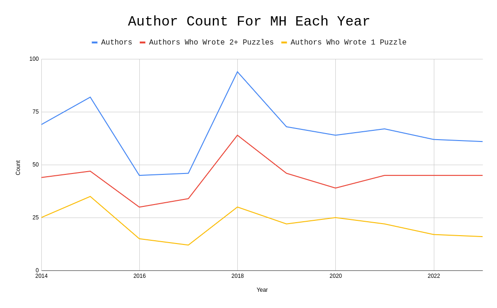

+++
title = "Mystery Hunt writing teams, by the numbers"
date = 2024-09-16

[taxonomies]
tags = ["analysis","puzzles","math"]
+++

I've recently been thinking about the composition of writing teams for Mystery Hunt. Call it looking at a potential future.

<!-- more --> 

If you have been even vaguely paying attention to the puzzlehunt community in the last 5 years, you probably have heard: Mystery Hunt is *really really big*. Writing something that large, with so many people involved, has to eventually become an industrial process. 

So how large, exactly, are these writing teams? Is there a lot of variance in the number of writers? What does the breakdown of manpower look like?

Is it true that if you're capable of winning a modern Mystery Hunt, you're capable of writing one?

And, additionally: if your puzzlehunt team won today, how big of a Mystery Hunt could you write?

### Table of Contents

1) <a href="#disclaimer">Disclaimer</a>
2) <a href="#related">Related Works</a>
3) <a href="#methodology">Methodology</a>
4) <a href="#writing-teams">What do writing teams look like?</a>
    1) <a href="#types">Author Types</a>
    2) <a href="#coauthors">Co-Authorship</a>
5) <a href="#bigger">Is Mystery Hunt getting bigger?</a>
    1) <a href="#count">The Puzzle Count Trend</a>
    2) <a href="#length">The Length Trend</a>
    3) <a href="#difficulty">The Difficulty Trend</a>
6) <a href="#my-team">How big could my writing team's Mystery Hunt be?</a>

<h3 id="disclaimer">Disclaimer about the Discourse</h3>

If you are the kind of person to read statistical analyses of writing teams for puzzlehunts, you are definitely going to be aware of the Discourse. 

I am not interested in talking about the Discourse. If you want to use these numbers as evidence for your point in the Discourse, then you may, but please don't try to ascribe your opinions onto me. I have opinions, but you're not going to find them here.

Okay, great.

<h3 id="related">Related Works</h3>

A few people have analyzed the writing of Mystery Hunt from a statistical perspective, but not very many. Here's everything I could find about it.

#### TTBNL QnA

> Personal opinion: I think a Hunt could be *writable* with a 30-person team, but only if all or most of the 30 people were actively involved for the entire year *and* you had multiple strong writers who could write at volume plus at least a couple of strong operations/logistics folks on board. And that's practically an impossible ask, because things happen: so-and-so gets busy at work, whatserface has a new baby, etc., and we are all smart people and know that nothing ever works 100% perfectly, and we need to leave ourselves room for error.

> I doubt a contemporary Hunt is *runnable* with 30 people, even if they are all in the right chairs and whizzes at some essential aspect of Hunt. Sleep alone would knock you down to 20 people at a time.

> However, I don't know that any particular "tradition" takes up more than its fair share of personnel/writing time on its own. Maybe executing a large event, but you can have events run by a handful of people, and they're short enough that they don't steal large amounts of human resources for long. Hints can now be managed primarily by remote team members who otherwise wouldn't have a role. Scavenger hunt submissions can also be "judged" by remote team members and don't take a lot of time to write (as Yougottabestopit mentioned).

> I'm not sure what the "minimum" team size would be to write/execute a hunt, but I'm guessing maybe around 40 if you shut HQ down from 1AM to 7 AM so you had most of your onsite folks awake and working for most of the day. That's a stab in the dark, though: would love to hear other opinions. 

> John/FromAtoZany (a TTBNL member)

> source: [We are TTBNL, creators of the 2024 MIT Mystery Hunt... Ask Us Anything!](https://www.reddit.com/r/mysteryhunt/comments/19cg7e7/comment/kiz0av1/)

#### Anecdote

FIXME: anecdote I remember

#### "Writing MIT Mystery Hunt 2023"

In his Pulitzer-deserving novella on the 2023 Mystery Hunt, Alex Irpan makes nice MATLAB plots of the number of writers per puzzle contribution from 2018 to 2023. 

> Puzzle writing seems to be yet another thing that follows [Zipf’s law](https://en.wikipedia.org/wiki/Zipf%27s_law), with lots of work on a few people and more work on the long tail.

He uses it to make some points about the relationship between difficulty and testsolving iterations:

> The 2018 Mystery Hunt is an outlier Hunt written by Death & Mayhem, one of the largest teams every year. Otherwise, Mystery Hunt is remarkably stable at around 60-65 puzzle writers per year. Left Out and Setec won with around 60 people, and ended with 60ish writers. Galactic was I believe around 80 people at time of win, and ended with 60ish writers. teammate won with around 55 people, and grew to 60ish writers. If every team has 60 writers, and teams work equally hard every year, and the distribution of work per person is similar, it seems reasonable to assume every year gets the same number of puzzlemaking hours.

> If puzzlemaking hours are constant each year, and teammate started with a difficulty bar that makes puzzles 1.5x longer than they should be, the only way that’s possible is if every puzzle had 1.5x fewer testsolving iterations. There’s no other way to fit it into the fixed time budget. You cannot push one up without pulling the other down.

And makes some advice about writing team sizes:

> Hunts empirically need around 60 writers. If you’re a team thinking of trying to win Hunt, and are smaller than 60 people… then, well, you should have an idea of who you’ll try to recruit.

> source: [Writing MIT Mystery Hunt 2023](https://www.alexirpan.com/2023/04/21/mh-2023.html)

#### That's all of them

If you can find more past work done on this, let me know.

<h3 id="methodology">Methodology</h3>

I scraped data from /dev/joe's [MIT Mystery Hunt Puzzle Index](https://devjoe.appspot.com/huntindex/index.html), from 2023 to 2014. I did sample some data from 2024, but as of writing the index is incomplete for that year. Consequently, I largely left it out of my analysis. (2024 was also a significant outlier in terms of writing team size and hunt length - though we shall see if it remains an outlier.)

Where numbers from 2024 are used, they are also supplemented with data from [the Puzzle Wiki](https://www.puzzles.wiki/wiki/MIT_Mystery_Hunt_2024). While that page is completely uncited, I trust the numbers to be fairly accurate, because puzzlers are sticklers for detail. 

If you don't mind some spoilers, you can view all of my data and calculations [in this spreadsheet](https://docs.google.com/spreadsheets/d/1eVXlza36Rq3bQ06HGS9Oa_ZnlpFAJxYuALwWwZobnto/edit?usp=sharing).

<h3 id="writing-teams">What do writing teams look like?</h3>

In the last 5 years, the number of credited authors has remained remarkably consistent:

For the last 5 years writing teams have had close to 65 authors. That number is sometimes slightly inflated by guest authors and group credits ([like Victoria Coren Mitchell](https://devjoe.appspot.com/huntindex/author/mitchellvictoriacoren), or [Andrew Hunter Murray and the QI Elves](https://devjoe.appspot.com/huntindex/author/murrayandrewhunterandtheqielves)) but that only occurs in a trivially small number of cases. 

However, not all authors are created equal. After playing around with the numbers a little, I found that breaking authors down into three distinct categories was fairly helpful:

1) <u>One-Puzzle Authors</u>: Authors which write for exactly 1 puzzle.
2) <u>Mid-Range Authors</u>: Authors which write for between 2 and 9 puzzles.
3) <u>Star Authors</u>: Authors which write for 10+ puzzles.

Additionally, not every author writes alone. Many Mystery Hunt puzzles are co-written. Thus, we'll also be looking at <u>co-authorship</u>: the average number of authors that each puzzle has in the Hunt.

I'll also sometimes refer to <u>Multi Authors</u>, which just means any author who writes for more than one puzzle. (This category contains both Mid-Range and Star authors.)

You could argue that this breakdown is a little flawed. If two authors write one puzzle each, then they'd both be One-Puzzle Authors, with those puzzles having a co-authorship of 1. But if those two authors each collaborate with each other, co-authoring the two puzzles, then they'd both be Mid-Range Authors, with their two puzzles having a co-authorship of 2.

Ultimately, though, I think the model is justifiable. Authors have a certain amount of time and energy they are willing to contribute to a hunt; often co-authoring a puzzle is just as much work as writing one on your own.

<h4 id="types">Author Types</h4>

The breakdowns were quite surprising. Here are the averages on author type for the last 5 and 10 years:

| Number of:          | 5-Year Mean ('19-23) &nbsp; | 10-Year Mean ('14-'23) &nbsp;  |
| :------------------ | :-------------------------- | :--------------------------- |
| Total Authors      | 64.4 (SD 3.05)               | 65.8 (SD 14.68)              |
| One-Puzzle Authors &nbsp; | 20.4 (SD 3.78)        | 21.9  (SD 7.16)              |
| Mid-Range Authors  | 31.8  (SD 2.77)              | 34.5   (SD 8.76)             |
| Star Authors       | 12.2  (SD 1.79)              | 9.4    (SD 3.34)             |

As you can see above, **for the last 5 years, authorship numbers have been incredibly consistent**. The standard deviation (SD) is a way of measuring how much the data differ from the purported average. These standard deviations are much smaller than one would expect for a writing team that completely changes every year.

You could claim that on average 3 people changed from being Mid-Range Authors to Star Authors, but it's hard to say that conclusively. The data are more noisy before 2019, with 2016 through 2018 all being relative outliers. (It is true that, broadly, there are many more Star Authors for more recent hunts than pre-2019 hunts.)

So, that's what the numbers say. Writing teams have **64ish total authors**, consisting of **20 One-Puzzle Authors**, **32 Mid-Range Authors**, and **12 Star Authors**.

How many puzzles do each of these types of author write, on average?

| Average Puzzles Per: &nbsp; | 5-Year Mean ('19-23) &nbsp; | 10-Year Mean ('14-'23) &nbsp; |
|:------------------|:----------------------------|:-----------------------------|
| Author (Any)     | 5.9 (SD 1.05)              | 5.17 (SD 1.18)              |
| Mid-Range Author  | 4.41 (SD 0.66)             | 4.27 (SD 0.63)              |
| Star Author      | 17.85 (SD 2.24)            | 17.64 (SD 1.68)             |

Again, these numbers are incredibly tight around the average. Mid-Range Authors write **between 4 and 5 puzzles**, and Star Authors write **between 17 and 18 puzzles**, although there is a greater deal of variance in the latter case.

It may seem strange to average the number of puzzles written for all Mid-Range authors; there would intuitively be a gulf between a person who writes 2 puzzles and 9 puzzles in terms of time-commitment. But the average number of puzzles written by a Mid-Range author comes out to be very consistent. The distribution of 2-puzzle authors to 9-puzzle authors is very similar from year to year! (You can see this qualitatively by observing Alex Irpan's graphs above.) 

These writers also tend to make up the "bulk" of the curve. (Which makes sense; we're cutting out the high and low outliers on either side.) If the average number of puzzles written by Mid-Range Authors was particularly high one year (and assuming that the number of Mid-Range Authors was about the same), we could say that the writing that year was particularly "distributed"; instead of most of the puzzles being written by Star Authors, a greater proportion of them were handled by the rest of the team. In practice, though, it doesn't seem like this ever happens.

What about co-authorship?

<h4 id="coauthors">Co-Authorship</h4>

<h3 id="bigger">Is Mystery Hunt getting bigger?</h3>

...compared to *what*?

Sorry, being a little facetious there. The real answer is: it's complicated.

<h4 id="count">The Puzzle Count Trend</h4>

<h4 id="length">The Hunt Length Trend</h4>

<h4 id="difficulty">The Difficulty Trend</h4>

<h3 id="my-team">How big could my writing team's Mystery Hunt be?</h3>

